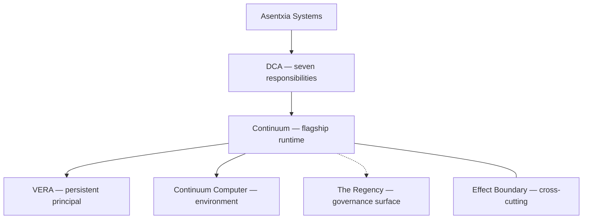

# Continuum

**The flagship runtime for Distributed Cognitive Architecture (DCA): a persistent principal, not a disposable model session.**

[](proofs/continuum-persistence-slice/)
[](proofs/continuum-persistence-slice/proof.py)
[](Makefile)

Continuum is Asentxia Systems’ implementation of **DCA** — a systems architecture for autonomous intelligence that must remain **one accountable principal** while models, sessions, credentials, processes, and runtimes change.

> The principal persists. The components may change.

**Proven today (Decision #2A):** a Continuum Computer ID and a VERA ID survive a clean process restart on the same host; durable state written before the restart is read after it; an active grant commits a mediated effect and revocation refuses the same capability; a verifier recomputes all eight acceptance criteria from raw evidence, not from stored flags.

```bash
make reproduce-p00
```

## Why it exists

Most agent stacks bind identity to a chat session, a process, or a model vendor. When the process dies, the “agent” is a new object wearing a familiar name.

DCA separates seven responsibilities so identity, state, authority, and evidence can outlive any one inference process. Continuum is the flagship implementation of that separation.

## Architecture

**Asentxia Systems** (company) → **DCA** (reference architecture) → **Continuum** (flagship runtime) → **VERA** (persistent principal). **The Regency** is the governance surface.

DCA’s seven responsibilities are Environment, State, Authority, Execution, Evidence, Coordination, and Cognition Boundary. The **Effect Boundary** is cross-cutting: cognition proposes, authority constrains, execution mediates, evidence records. It is not an eighth responsibility.



| Stack | Role | Maturity |
|---|---|---|
| [`proofs/continuum-persistence-slice/`](proofs/continuum-persistence-slice/) | Stdlib two-process SQLite proof (Decision #2A) | Working and tested |
| [`backend/`](backend/) + [`frontend/`](frontend/) | Mongo orchestrator and ops dashboard | Working but untested |

Deeper map: [docs/ARCHITECTURE.md](docs/ARCHITECTURE.md) · [docs/docs/DCA_RESPONSIBILITY_MAP.md](docs/docs/DCA_RESPONSIBILITY_MAP.md)

## Capabilities

| Capability | Code | Proof or test |
|---|---|---|
| Continuum Computer ID across same-host process restart | [`proof.py`](proofs/continuum-persistence-slice/proof.py) (`identity`, `computer.created`) | AC-1 in [`test_proof.py`](proofs/continuum-persistence-slice/test_proof.py) |
| VERA ID across same-host process restart | same harness (`vera.created`, `identity_continuity`) | AC-2 |
| Durable marker written before restart, read after | SQLite `durable_state` | AC-3 |
| Scoped grant: commit, then revoke, then deny same capability | SQLite `grants` / `effects` | AC-4 |
| Post-restart effect through a non-model mediator | `mediate_effect()` — `in_process_sqlite_status_write` | AC-5 |
| Structured evidence; verifier recomputes ACs from raw fields | `compute_acceptance`, `verify_artifact` | AC-6, AC-8 |
| VERA remains bound to the same Computer | `identity_continuity.bound_computer_id` | AC-7 |
| Public proof page (static HTML contract) | [`public/proof/continuum-persistence/index.html`](public/proof/continuum-persistence/index.html) | [`test_public_page.py`](proofs/public-proof-page/test_public_page.py) |

**In progress:** Mongo orchestrator, ops dashboard, Regency, scaffolds, and design goals — [docs/CAPABILITIES.md](docs/CAPABILITIES.md).

## Quickstart

Python 3.12 and `make`. Stdlib only; no network or secrets.

```bash
python3 --version
make reproduce-p00
```

This runs the unit suite, a fresh two-process proof, and a separate verify step.

```bash
python3 -m unittest -v proofs/continuum-persistence-slice/test_proof.py
python3 -m unittest -v proofs/public-proof-page/test_public_page.py
make verify-evidence
```

## Reproduce the proof

Harness and runbook: [`proofs/continuum-persistence-slice/`](proofs/continuum-persistence-slice/). Scope: see [Limits and non-goals](#limits-and-non-goals).

```bash
make reproduce-p00
```

**Expected** (UUIDs and PIDs change each run):

- `python3 -m unittest -v proofs/continuum-persistence-slice/test_proof.py` — **15 tests, `OK`**
- `proof.py run` — `"valid": true`, AC-1 through AC-8 `true`, `"evidence_events": 11`, `"sequence_contiguous": true`, `"producer_acceptance_ignored": true`, distinct phase-1 and phase-2 process IDs, `COMMITTED` then `DENIED`
- `proof.py verify` on the `.run` artifact — same acceptance, exit status `0`

P00 LaTeX is not in this repository. `make reproduce-p00` is the harness path (`reproduce-p00-harness`).

## Repository layout

```
proofs/continuum-persistence-slice/   Decision #2A harness, tests, runbook
public/proof/continuum-persistence/   Static proof page
docs/                                 Architecture, capabilities, claims ledger
artifact/                             P00 claim package (no manuscript TeX)
backend/                             FastAPI orchestrator (Mongo)
frontend/                             CRA ops dashboard
src/, index.html                      Vite landing shell
packages/                             Vendored lineage (own tests; not in #2A)
Makefile                              reproduce-p00, verify-evidence, test-p00
```

## Limits and non-goals

Same-host clean process restart only: two sequential OS processes share one SQLite store; phase 1 exits normally (no kill or crash). The verifier is a separate, internal script by the same author, not third-party verification. The effect is a local, mediated SQLite write, not an external side effect. This does not demonstrate crash recovery, host migration, model/provider replacement, external effects, third-party verification, cryptographic notarization, or production readiness.

Also outside this slice: complete implementation of all seven DCA responsibilities; DCA as an external industry standard; universal security or isolation; live remote computers from the orchestrator.

Ledger: [docs/evidence/CURRENT_CLAIMS_AND_MATURITY_LEDGER.md](docs/evidence/CURRENT_CLAIMS_AND_MATURITY_LEDGER.md).

## Status and roadmap

**Verified:** Decision #2A persistence slice, recomputing verifier, archived artifact from a real run.

**Building:** Mongo orchestrator, ops dashboard, Regency routes, session handoff — [docs/CAPABILITIES.md](docs/CAPABILITIES.md).

**Next:** compose vendored lineage into Continuum proofs; crash recovery; host migration; model/provider replacement; multi-VERA coordination; third-party verification; cryptographic notarization; production operations; root license and security policy.

## License, contributing, security

The repository root has no `LICENSE`, `CONTRIBUTING.md`, or `SECURITY.md`.

Some vendored trees ship their own files (MIT under `packages/nexus/LICENSE`, `packages/aeon-iq/LICENSE`, `packages/context-kernel/LICENSE`). Those apply to those trees only.
