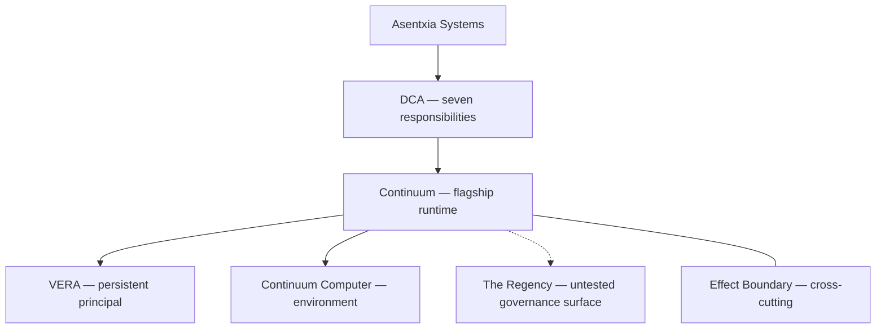

# Continuum

**The flagship runtime for Distributed Cognitive Architecture (DCA): a persistent principal, not a disposable model session.**

[](proofs/continuum-persistence-slice/)
[](proofs/continuum-persistence-slice/proof.py)
[](Makefile)

Continuum is Asentxia Systems’ implementation of **DCA** — a systems architecture for autonomous intelligence that must remain **one accountable principal** while models, sessions, credentials, processes, and runtimes change.

> The principal persists. The components may change.

That sentence is a design rule. Only the Decision #2A slice below is experimentally verified in this repository.

## Why it exists

Most agent stacks bind identity to a chat session, a process, or a model vendor. When the process dies or the model is swapped, the “agent” is a new object wearing a familiar name.

DCA separates seven responsibilities so identity, state, authority, and evidence can outlive any one inference process. Continuum is the flagship attempt to implement that separation. The current verified result is narrow: **one Computer, one VERA, one clean process restart on one host**, with a local mediated write and a recomputed evidence artifact.

## Architecture

**Asentxia Systems** (company) → **DCA** (reference architecture) → **Continuum** (flagship runtime) → **VERA** (persistent principal). **The Regency** is a governance API/UI surface, not a proven control plane.

DCA’s seven responsibilities are Environment, State, Authority, Execution, Evidence, Coordination, and Cognition Boundary. The **Effect Boundary** is cross-cutting: cognition proposes, authority constrains, execution mediates, evidence records. It is not an eighth responsibility.



Two stacks live in this tree. They are not interchangeable:

| Stack | Role | Maturity |
|---|---|---|
| [`proofs/continuum-persistence-slice/`](proofs/continuum-persistence-slice/) | Stdlib two-process SQLite proof (Decision #2A) | Working and tested |
| [`backend/`](backend/) + [`frontend/`](frontend/) | Mongo orchestrator and ops dashboard | Working but untested |

Deeper map: [docs/ARCHITECTURE.md](docs/ARCHITECTURE.md) · [docs/docs/DCA_RESPONSIBILITY_MAP.md](docs/docs/DCA_RESPONSIBILITY_MAP.md)

## Capabilities

Maturity is conservative. **Working and tested** means Continuum tests in this repo exercise the claim. Vendored package tests are not Continuum integration proofs.

| Capability | Maturity | Code | Proof or test |
|---|---|---|---|
| Continuum Computer ID across same-host process restart | Working and tested | [`proofs/continuum-persistence-slice/proof.py`](proofs/continuum-persistence-slice/proof.py) (`identity`, `computer.created`) | AC-1 in [`test_proof.py`](proofs/continuum-persistence-slice/test_proof.py) |
| VERA ID across same-host process restart | Working and tested | same harness (`vera.created`, `identity_continuity`) | AC-2 |
| Durable marker written before restart, read after | Working and tested | SQLite `durable_state` | AC-3 |
| Scoped grant: commit, then revoke, then deny same capability | Working and tested | SQLite `grants` / `effects` | AC-4 |
| Post-restart effect through a non-model mediator | Working and tested | `mediate_effect()` — class `in_process_sqlite_status_write` | AC-5 |
| Structured evidence, verifier recomputes ACs | Working and tested | `compute_acceptance`, `verify_artifact` | AC-6, AC-8; ignores stored booleans |
| VERA remains bound to the same Computer | Working and tested | `identity_continuity.bound_computer_id` | AC-7 |
| Public proof page (static HTML contract) | Working and tested | [`public/proof/continuum-persistence/index.html`](public/proof/continuum-persistence/index.html) | [`proofs/public-proof-page/test_public_page.py`](proofs/public-proof-page/test_public_page.py) (not in `make reproduce-p00`) |
| Orchestrator VERA / grant / effect / evidence APIs | Working but untested | [`backend/server.py`](backend/server.py), [`backend/models.py`](backend/models.py) | No `backend/` tests |
| Orchestrator hash-chained evidence + capsules | Working but untested | [`backend/evidence.py`](backend/evidence.py), [`backend/capsule.py`](backend/capsule.py) | None |
| Orchestrator memory adapter | Working but untested | [`backend/adapters/aeon_iq.py`](backend/adapters/aeon_iq.py) | None; not AEON-IQ Postgres |
| Orchestrator execution adapter | Working but untested | [`backend/adapters/nexus.py`](backend/adapters/nexus.py) | None; wasmtime optional, echo fallback |
| Sessions / handoff | Working but untested | `/api/dca/sessions/*` | None. Not multi-agent coordination. |
| The Regency (mandates, roles, emergency suspend) | Working but untested | `/api/regency/*`, [`frontend/src/App.js`](frontend/src/App.js) | None |
| Ops dashboard | Working but untested | [`frontend/`](frontend/) | No `*.test.*` files |
| Vite landing shell | Scaffold or stub | [`src/App.jsx`](src/App.jsx) | Visual mock; figures on that page are not measurements |
| Placement as a real remote computer | Scaffold or stub | Orchestrator writes synthetic `computer_id`s | Vendored environment tree is not called |
| Coordination / multi-VERA | Design goal | Session documents only | Decision #2A: out of scope |
| Crash recovery, host migration | Design goal | Explicitly unproven (`excluded_scope`) | AC-8 fails if marked proven |
| Model / provider replacement | Design goal | Process restart only | `excluded_scope.model_provider_replacement` |
| Production readiness | Design goal | — | Not claimed |

Vendored trees under [`packages/`](packages/) (AEON-IQ, Genesis, NEXUS, Context Kernel, and an environment lineage directory) keep their own tests. They are **not integrated** into Decision #2A. See [artifact/CLAIMS.md](artifact/CLAIMS.md).

## Quickstart

Requires **Python 3** (this environment: 3.12) and `make`. No extra packages, network, or secrets.

```bash
python3 --version
make reproduce-p00
```

That is the only Continuum path that is working and tested end to end. It runs the unit suite, a fresh two-process proof, and an independent verify.

Optional checks that also ran cleanly here:

```bash
python3 -m unittest -v proofs/continuum-persistence-slice/test_proof.py
python3 -m unittest -v proofs/public-proof-page/test_public_page.py
make verify-evidence
```

The Mongo orchestrator (`backend/` + `frontend/`) needs `MONGO_URL` and `DB_NAME`. This environment has no Mongo listener and no orchestrator tests, so those commands are not documented as a working quickstart.

## Reproduce the proof

Harness and runbook: [`proofs/continuum-persistence-slice/`](proofs/continuum-persistence-slice/).

```bash
make reproduce-p00
```

**Expected (values such as UUIDs and PIDs change each run):**

- `python3 -m unittest -v proofs/continuum-persistence-slice/test_proof.py` — **15 tests, `OK`**
- `proof.py run` — `"valid": true`, AC-1 through AC-8 `true`, `"evidence_events": 11`, `"sequence_contiguous": true`, `"producer_acceptance_ignored": true`, distinct phase-1 and phase-2 process IDs, `COMMITTED` then `DENIED`
- `proof.py verify` on the `.run` artifact — same acceptance, exit status `0`

P00 LaTeX is not in this repository. `make reproduce-p00` is the harness path only (`reproduce-p00-harness`).

Same-host clean process restart only: two sequential OS processes share one SQLite store; phase 1 exits normally (no kill or crash). The verifier is a separate, internal script by the same author, not third-party verification. The effect is a local, mediated SQLite write, not an external side effect. This does not demonstrate crash recovery, host migration, model/provider replacement, external effects, third-party verification, cryptographic notarization, or production readiness.

## Repository layout

```
proofs/continuum-persistence-slice/   Decision #2A harness, tests, runbook
public/proof/continuum-persistence/   Static proof page
docs/                                 Architecture, responsibility map, claims ledger
artifact/                             P00 claim package (no manuscript TeX)
backend/                             FastAPI orchestrator (Mongo; untested)
frontend/                             CRA ops dashboard (untested)
src/, index.html                      Vite landing shell (scaffold)
packages/                             Vendored lineage; own tests; not composed into #2A
Makefile                              reproduce-p00, verify-evidence, test-p00
```

## Limits and non-goals

Same-host clean process restart only: two sequential OS processes share one SQLite store; phase 1 exits normally (no kill or crash). The verifier is a separate, internal script by the same author, not third-party verification. The effect is a local, mediated SQLite write, not an external side effect. This does not demonstrate crash recovery, host migration, model/provider replacement, external effects, third-party verification, cryptographic notarization, or production readiness.

Also not shown: complete implementation of all seven DCA responsibilities; DCA as an external industry standard; security or isolation as universal properties; live remote computers from the orchestrator.

Ledger: [docs/evidence/CURRENT_CLAIMS_AND_MATURITY_LEDGER.md](docs/evidence/CURRENT_CLAIMS_AND_MATURITY_LEDGER.md).

## Status and roadmap

**Now (verified):** Decision #2A persistence slice, recomputing verifier, archived artifact from a real run.

**Now (present, untested):** Mongo orchestrator, ops dashboard, Regency routes, session handoff documents.

**Future (not claimed):** compose vendored lineage into Continuum proofs; crash recovery; host migration; model/provider replacement; multi-VERA coordination; third-party verification; cryptographic notarization; production operations; root license and security policy.

## License, contributing, security

The repository **root has no** `LICENSE`, `CONTRIBUTING.md`, or `SECURITY.md`. Do not assume a license from this page.

Some vendored trees ship their own files (for example MIT under `packages/nexus/LICENSE`, `packages/aeon-iq/LICENSE`, `packages/context-kernel/LICENSE`). Those apply to those trees only.
