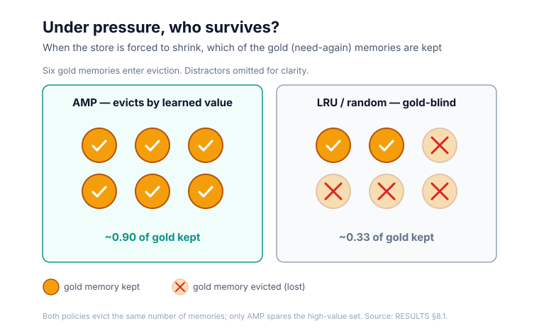
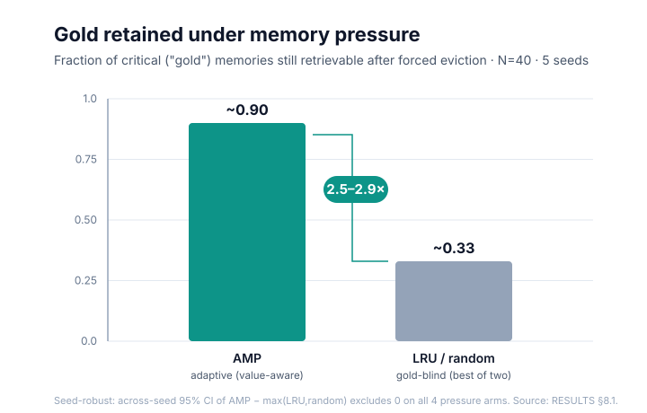

# Nexus-IQ — Memory That Survives Pressure
### White paper (investor & technical-buyer)

**Audience:** investors and technical buyers/operators evaluating Nexus-IQ.
**Posture: honest single-win.** The pitch rests on one proven, CI-backed capability; being
explicit about scope is a *trust signal*, not a weakness.
**Source of truth:** every figure here is the canonical RESULTS §8.1 A12 table — the same data
the research paper reports. One dataset, two audiences.
**System:** Nexus-IQ is the product; its memory engine is AEON-IQ — a Rust/pgvector kernel with
the AMP eviction policy. The evidence below is measured on AEON-IQ.

---

## 1. Executive summary

Agent memory can't grow forever. As long-running agents accumulate facts, context and storage
budgets force the system to forget — and *what* it forgets decides whether the agent can still
answer tomorrow's question. Nexus-IQ's memory engine, AEON-IQ, keeps the memories that matter:
under pressure its adaptive eviction (AMP) retains **~2.5–2.9× more** of the critical ("gold") memories than standard
recency- or random-based eviction — a result validated with 95% confidence intervals across
**five independent seeds**, and robust on **all four** tested configurations.

One proven, measured advantage — and one honesty line we hold to: the learning and
personalization components are on a published research roadmap, not yet claimed.

## 2. The problem

Long-running agents accumulate memory without bound, but context windows and storage are
finite, so the store must eventually be cut back. Naive eviction — drop the least recently
used, or drop at random — is blind to *value*: it discards the facts a user will need again
just as readily as it discards noise. The right way to measure this is **gold survival**:
after the system is forced to forget, how much of what actually mattered is still retrievable?
That single question is what Nexus-IQ is built — and measured — to win.

## 3. The approach — AMP adaptive eviction

AMP (Adaptive Memory Pressure) learns a per-memory utility signal from how memories are used
and from feedback, and evicts by *learned value* rather than by recency or chance. A controller
holds the store near a target size while preferentially sparing the high-value set. The result
is a memory that shrinks under pressure without throwing away the facts that carry the
relationship forward.

**Figure — pressure → who survives.** A store forced under a size cap; AMP retains the gold
memories while recency/random eviction discards them.

## 4. The evidence — one robust, honest result

Under controlled memory pressure, AEON-IQ's AMP policy retains **2.5–2.9× more gold** than
gold-blind baselines (LRU and random). Concretely, AMP keeps roughly **89–91%** of gold memories through eviction,
while the better of the two gold-blind baselines keeps only **~32–35%**. The advantage held
across **five independent seeds** on **all four** tested configurations, with a 95% confidence
interval that excludes zero every time — i.e., not a lucky single run.

**Figure 1 — gold retained under pressure, AMP vs. the better gold-blind baseline.**

Every number above is the canonical RESULTS §8.1 value; the full per-seed table and confidence
intervals live in the research paper (one shared source, so the two documents cannot drift).

**What we are NOT claiming yet.** The stronger "smart opponent" — a frequency/utility-aware
gold-blind baseline — and the online-learning/personalization component are *not* measured in
this result. They are structurally out of reach of the current retrieval-only benchmark and are
scheduled for the next research phase (A16). We would rather name that gap than paper over it.

## 5. Why it matters / positioning

Against a naive vector-store memory that either grows forever or forgets blindly, Nexus-IQ offers
a memory that stays bounded *and* keeps what counts. Just as important is *how* the claim is
made: we publish the benchmark, pre-commit the success criteria before running, report every
seed, and disclose the misses. In a market thick with unquantified "long-term memory" claims, a
pre-registered, confidence-interval-backed number is the differentiator — trust as a feature.

## 6. Roadmap

- **Next research phase (A16):** measure the online-learning/personalization components and a
  stronger gold-blind (frequency/utility) baseline on the chat path — closing the two gaps named
  in §4 with the same pre-registered discipline.
- **Product:** self-host kit → hosted/web app + remote MCP (per the product blueprint). Papers
  first, product next: this is the launch track after the evidence lands.

## 7. Honest limitations / what's next

The proven win is specifically **gold survival under eviction pressure**, on a single benchmark
family (LongMemEval-S), at N = 40, with one embedding model. The online-learning and
smart-baseline results are pending the A16 phase; the adaptive controller did not fully converge
within the sweep cap (a valid same-size comparison, not a convergence claim); and the confidence
intervals, while honest, are computed over five seeds. None of these touches the core result —
they bound it. A claim you can see the edges of is one you can trust.

---
*Draft complete. Figure 1 and the §3 diagram are embedded as `figures/fig1_gold_retention_bar.svg`
and `figures/fig2_pressure_survival.svg`. Every number traces to canonical RESULTS §8.1; §7 is
kept intact — not softened to match the headline.*
